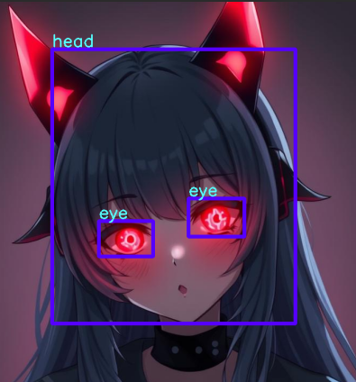

# Bounding Box Annotation Tool

A PyQt5-based GUI application for creating, editing, and managing bounding box annotations on images.



## License

This project is licensed under the GNU General Public License v3.0 - see the [LICENSE](LICENSE) file for details.

This license is required due to the use of PyQt5, which is licensed under GPL-3.0.

### Dependencies
- PyQt5 (GPL-3.0)
- OpenCV (BSD 3-Clause)
- Python Standard Library (PSF License)

## Features

- Draw and edit bounding boxes on images
- Two operation modes: Draw and Edit
- Label management with grouping support
- Batch processing with directory support
- Customizable appearance settings
- Dark/Light theme support
- Persistent settings and recent paths
- JSON-based annotation storage

## Quick Start

1. Launch the application
2. Use `Ctrl+I` to open an image or `Ctrl+D` to open a directory
3. Enter a label in the label input field
4. Press `D` for Draw Mode or `E` for Edit Mode
5. Draw or edit bounding boxes using the mouse
6. Press `Ctrl+S` to save annotations

## Documentation

- [Controls and Shortcuts](docs/controls.md)
- [Appearance Settings](docs/appearance.md)

## Interface Overview

### Main Window Components

- **Mode Selector**: Toggle between Draw and Edit modes
- **Image Area**: Displays the current image with annotations
- **File List**: Shows available images in the current directory
- **Label Management**:
  - Label input for new annotations
  - List of previously used labels
  - Current image labels with grouping option
### File Operations

- Supports common image formats (PNG, JPG, JPEG, BMP, GIF)
- Automatic aspect ratio preservation
- Directory-based batch processing
- Persistent directory history
- Automatic annotation file management

## Technical Details

### Settings Storage

All application settings are stored in:
```
~/.bbox_ann_tool/settings.ini
```

Settings include:
- Recent directories
- Color preferences
- Theme selection
- Display settings

### Annotation Format

Annotations are saved as JSON files in the output directory:

```json
{
    "annotations": [
        {
            "label": "example",
            "bbox": [x1, y1, x2, y2]
        },
        ...
    ]
}
```

The bbox coordinates are stored as `[left, top, right, bottom]` in image pixel coordinates.
